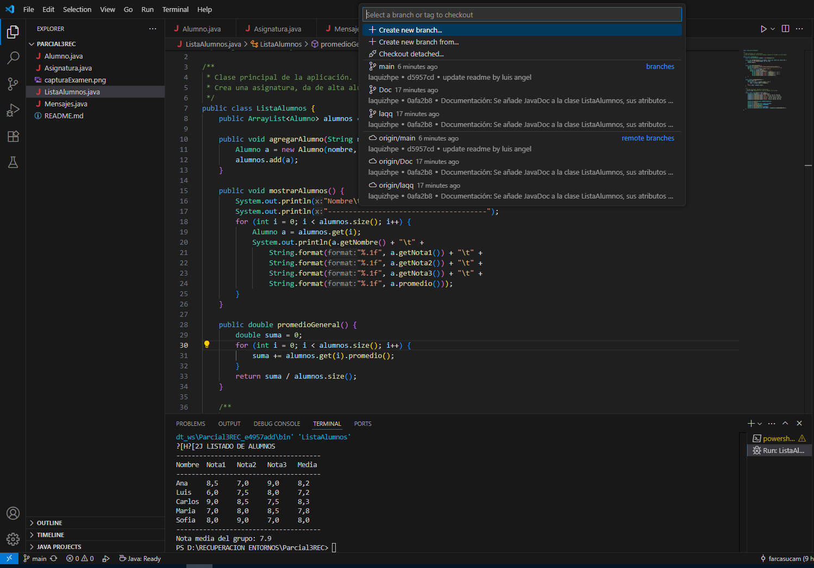

# Gestión de Alumnos

Autor: LUIS ANGEL QUIZHPE QUIZHPE

## Descripción

Este proyecto es una aplicación Java para la gestión de alumnos en una asignatura. Permite dar de alta alumnos con tres notas, mostrar el listado de alumnos con sus calificaciones y calcular la nota media del grupo.  
El código está estructurado en varias clases:

- **Alumno**: Representa a un alumno y sus notas, con validación y métodos de acceso.
- **Asignatura**: Gestiona la lista de alumnos y las operaciones principales (alta, listado, media).
- **Mensajes**: Contiene todos los textos fijos usados en pantalla como constantes, facilitando la traducción y el mantenimiento.
- **ListaAlumnos**: Clase principal con el método `main` para ejecutar la aplicación.

El proyecto está documentado con JavaDoc y utiliza buenas prácticas de encapsulamiento y separación de responsabilidades.

## Vista de ramas y commits

A continuación se muestra una captura de pantalla de la vista de ramas y commits del proyecto en Visual Studio Code:

